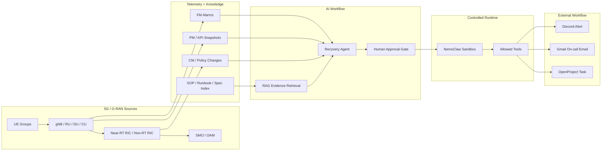

# Architecture Notes

更新日期：2026-06-11

## Target Architecture



## Frontend Responsibilities

The frontend should not directly perform risky external actions. Its responsibilities are:

- visualize O-RAN topology and impacted path
- show alarm/KPI/config evidence
- show RAG citations
- show Agent tool trace
- collect human approval
- display notification/task results

## Backend / Agent Responsibilities

- normalize alarm, KPI, topology, and config events
- retrieve SOP/runbook evidence
- generate structured root-cause candidates
- propose reversible recovery plans
- enforce approval gates
- execute only allowed tools through a controlled runtime

## Suggested Next.js Structure

```text
app/
  page.tsx
  topology/page.tsx
  alarms/page.tsx
  diagnosis/page.tsx
  recovery/page.tsx
  knowledge/page.tsx
components/
  oran-flow/
  alarm-table/
  diagnosis-panel/
  agent-trace/
  approval-gate/
lib/
  mock-api/
  oran-models.ts
  agent-tools.ts
  rag-evidence.ts
```

## Data Models

```ts
type Severity = "normal" | "warning" | "minor" | "major" | "critical";

type Alarm = {
  id: string;
  severity: Severity;
  title: string;
  nodeId: string;
  timestamp: string;
  probableCause?: string;
};

type AgentStep = {
  id: string;
  tool: string;
  status: "pending" | "running" | "done" | "failed" | "approval_required";
  inputSummary: string;
  resultSummary?: string;
  riskLevel: "low" | "medium" | "high";
};
```

## Demo Story

1. A URLLC slice SLA breach appears.
2. DU packet loss and Near-RT RIC latency rise together.
3. RAG retrieves SOP evidence for policy-loop latency escalation.
4. Agent finds a recent xApp handover policy change.
5. Agent proposes a reversible dry-run rollback.
6. Human approval is required before any external action.
7. NemoClaw executes mock notification tools.
8. The frontend shows verification metrics and an incident report.

## Implemented Static Demo Flow

The current static app now includes a browser-only simulation of the approval and tool-execution flow:

```text
Run Recovery Agent
  -> Agent steps reach request_human_approval
  -> operator approves or rejects
  -> mock tools update status
  -> incident report draft is generated or blocked
```

Mock tools:

- `send_discord_alert`
- `send_gmail_alert`
- `create_openproject_task`
- `write_incident_report`

This keeps the demo safe because no external side effects are executed by the browser. The UI only demonstrates the product workflow that a future NemoClaw runtime would execute through controlled tools.
